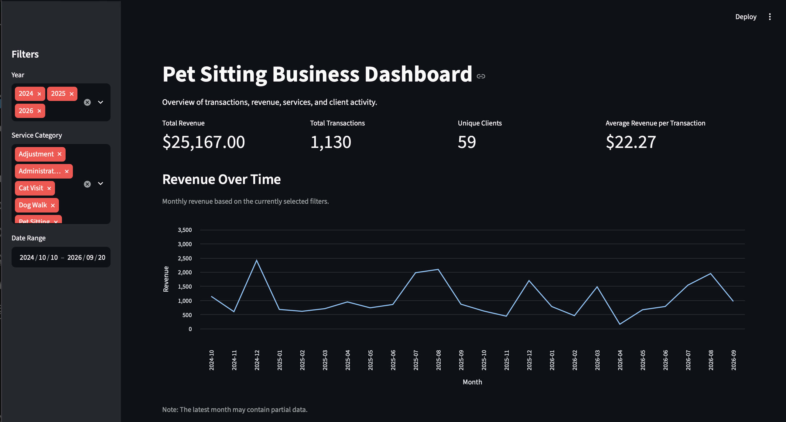
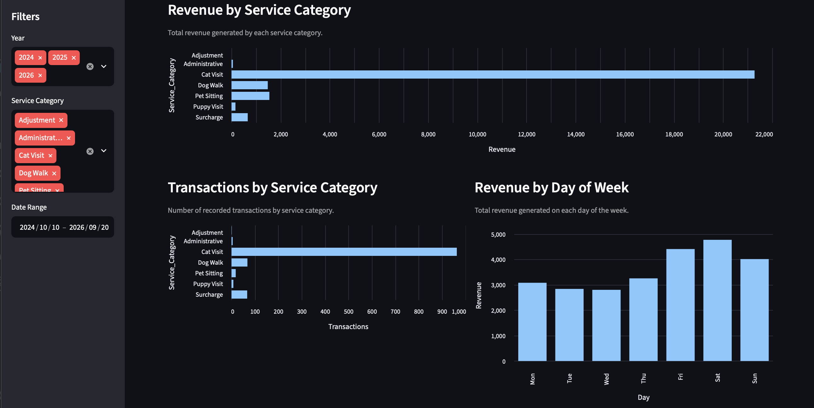
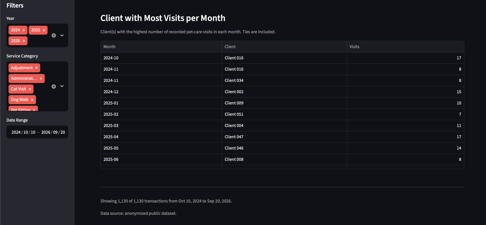

# Pet Sitting Operations Analytics Pipeline

An end-to-end data analytics project that transforms recurring pet-care service records into a validated SQLite database and interactive Streamlit dashboard.

The project demonstrates a reproducible ETL workflow using Python and pandas, SQL-based analysis with SQLite, data quality validation, privacy-conscious data publishing, and interactive business reporting.

## Project Overview

The source data consists of recurring CSV reports containing pet-care service transactions, including service dates, clients, service types, and payment amounts.

The pipeline:

1. Extracts and combines multiple CSV source files.
2. Cleans and standardizes transaction-level data.
3. Validates source totals and data quality.
4. Loads the transformed data into SQLite.
5. Performs SQL-based business analysis.
6. Creates an anonymized dataset for public use.
7. Visualizes operational and revenue metrics in Streamlit.

The pipeline is designed to support new reporting periods without requiring changes to the core ETL logic.

## Project Architecture

The project separates private operational data from the anonymized data used for the public portfolio.

```text
Private CSV Reports
        |
        v
     Extract
        |
        v
    Transform
        |
        +------> Data Quality Validation
        |
        v
 SQLite Database
        |
        +------> SQL Analysis
        |
        v
  Anonymization
        |
        v
 Public Dataset
        |
        v
Streamlit Dashboard
```

Locally, the dashboard reads from the private SQLite database. If the private database is unavailable, it automatically falls back to the anonymized public dataset.

This allows the same dashboard code to support both private operational analysis and a privacy-safe public portfolio.

## ETL Pipeline

### 1. Extract

`src/extract.py` discovers the available CSV reports, excludes superseded source files, combines the active files, and preserves the source filename for lineage and auditing.

This allows new reporting-period CSV files to be incorporated into the pipeline without modifying the core extraction logic.

### 2. Transform

`src/transform.py` prepares the transaction-level dataset by:

- Removing report-level `TOTALS` rows.
- Removing unnecessary source columns.
- Converting dates into datetime values.
- Converting payment values into numeric data.
- Trimming inconsistent whitespace.
- Standardizing service descriptions into analytical categories.
- Preserving the original service description.
- Retaining source-file lineage.
- Generating unique transaction IDs.

The standardized service categories are:

- Cat Visit
- Dog Walk
- Pet Sitting
- Puppy Visit
- Surcharge
- Administrative
- Adjustment

### 3. Validate

`src/validate_source_totals.py` independently compares the sum of transaction-level payments in each source file with the total reported by that source.

For the current dataset:

- 51 active source files were validated.
- 51 files passed reconciliation.
- 0 files failed.
- 0 files require additional reconciliation.

Additional data-quality checks identify:

- Missing required values.
- Zero-value transactions requiring review.
- Negative payment values.
- Potential duplicate records.
- Transactions appearing across multiple source files.

### 4. Load

`src/load_database.py` rebuilds a SQLite database using an explicit schema and loads the transformed transactions into the `services` table.

The database contains the following fields:

```text
Transaction_ID
Day
Date
Client
Service
Pay
Source_File
Service_Category
```

`Transaction_ID` is used as the primary key.

### 5. Analyze

`src/query_database.py` performs SQL-based analysis directly against SQLite.

The analysis includes:

- Total transaction volume.
- Unique transaction validation.
- Total revenue.
- Revenue by service category.
- Revenue by individual service.
- Monthly revenue and transaction volume.
- Revenue by day of week.
- Client-level activity.
- Client revenue by service category.
- Missing-value checks.
- Zero-value transaction review.
- Negative-payment checks.

### 6. Anonymize

`src/anonymize_data.py` creates a privacy-safe version of the processed dataset for public use.

The anonymization process:

- Replaces client names with anonymous identifiers such as `Client 001`.
- Removes source filenames from the public dataset.
- Preserves transaction counts.
- Preserves the number of unique clients.
- Validates the format of every anonymized client identifier.

Private client information and the local SQLite database are excluded from version control.

### 7. Visualize

`dashboard/dashboard.py` provides an interactive Streamlit dashboard.

Users can filter the data by:

- Year.
- Service category.
- Date range.

The dashboard dynamically recalculates KPIs and visualizations based on the selected filters.

## Dashboard

The dashboard includes four primary KPIs:

- Total Revenue
- Total Transactions
- Unique Clients
- Average Revenue per Transaction

Additional visualizations include:

- Revenue over time.
- Revenue by service category.
- Transactions by service category.
- Revenue by day of week.
- Client with the most visits per month.

Only visit-based services are included when calculating monthly visit leaders, preventing administrative transactions and surcharges from being counted as pet visits.

The dashboard also detects whether it is running with the private local database or the anonymized public dataset.

## Dashboard Preview

### Overview and Revenue Trends



### Service and Operational Analysis



### Client Visit Analysis



## Current Dataset

The current processed dataset contains:

| Metric | Value |
| --- | ---: |
| Active source files | 51 |
| Transactions | 1,130 |
| Unique clients | 59 |
| Total revenue | $25,167 |
| Missing required values | 0 |
| Negative payment transactions | 0 |
| Source files passing reconciliation | 51 / 51 |

The data currently covers transactions from October 2024 through September 2026.

The latest reporting period may represent a partial month and should not be interpreted as directly comparable with completed months.

## Data Quality Decisions

Real operational data often requires business context before records can be classified as errors. Several quality decisions in this project were therefore handled explicitly rather than through automatic deletion.

### Source Total Reconciliation

Each source report contains a reported total.

Instead of assuming that imported transaction values are correct, the validation stage independently recalculates each file's transaction total and compares it with the source total.

All 51 active source files currently reconcile successfully.

### Superseded Source File

Two versions of one December reporting period were present in the raw data.

The original report was retained in the private raw-data directory for traceability but excluded from the ETL pipeline because a revised version superseded it.

This prevents the same reporting period from being loaded twice while preserving the original source file for auditing.

### Duplicate-Looking Transactions

Some records contain identical values for:

```text
Date + Client + Service + Pay
```

These records were investigated rather than automatically removed.

The review showed that multiple identical-looking transactions can represent legitimate repeated visits for the same client on the same day.

For this reason, the pipeline does not use blanket duplicate removal.

A separate cross-file validation also checks whether identical transaction groups appear across multiple active source files.

### Zero-Value Transactions

Eight transactions currently have a payment value of `$0`.

These records were reviewed and retained because they represent valid recorded business activity, including cancelled services, administrative activity, an adjustment, and a service for which no surcharge was ultimately charged.

Zero-value records are therefore flagged for review rather than automatically deleted.

### Empty Source File

One source report contains no transaction rows and a total of `$0`.

The validation process retains and successfully reconciles the file instead of treating an empty reporting period as an ETL failure.

## Key Insights

The current dataset shows several descriptive patterns:

- Cat visits represent the majority of transaction volume and revenue.
- Revenue and transaction activity vary considerably across reporting periods.
- Saturdays currently have the highest total revenue and transaction volume by day of week.
- July and August show relatively high transaction activity in both years represented in the dataset.
- Service surcharges contribute additional revenue while remaining separate from the underlying visit categories.

These findings are descriptive and do not establish the causes of the observed patterns.

The latest month in the dataset may be incomplete, so comparisons with completed months should be interpreted accordingly.

## Privacy and Data Protection

The original operational data contains private client information and is not included in the public repository.

The following are excluded through `.gitignore`:

```text
data/raw/
data/processed/
database/*.db
database/*.sqlite
database/*.sqlite3
logs/
.env
```

Only the anonymized dataset in:

```text
data/public/anonymized_services.csv
```

is intended for public use.

The Streamlit dashboard supports two data modes:

**Private mode**

If `database/petsitting.db` exists, the dashboard uses the local SQLite database containing the private operational data.

**Public mode**

If the private database is unavailable, the dashboard automatically loads the anonymized public CSV.

This separation allows continued local use of the project with real operational records without exposing client information in the public portfolio.

## Project Structure

```text
petsitting-dashboard/
|
├── dashboard/
│   └── dashboard.py
|
├── data/
│   ├── raw/                         # Private, excluded from Git
│   ├── processed/                   # Private, excluded from Git
│   └── public/
│       └── anonymized_services.csv
|
├── database/
│   └── petsitting.db                # Private, excluded from Git
|
├── images/
|
├── src/
│   ├── anonymize_data.py
│   ├── extract.py
│   ├── load_database.py
│   ├── query_database.py
│   ├── transform.py
│   └── validate_source_totals.py
|
├── tools/
│   ├── audit_source_files.py
│   ├── check_cross_file_duplicates.py
│   ├── check_duplicates.py
│   ├── compare_december.py
│   ├── duplicate_by_file.py
│   ├── duplicate_frequency.py
│   ├── inspect_data.py
│   ├── inspect_database.py
│   ├── inspect_services.py
│   ├── inspect_source_file.py
│   ├── investigate_duplicates.py
│   └── investigate_same_file_duplicates.py
|
├── .gitignore
├── README.md
└── requirements.txt
```

The `src/` directory contains the core reproducible data pipeline.

The `tools/` directory contains supporting utilities used during source-data investigation, duplicate analysis, database inspection, and quality assurance.

## Technologies

- **Python** for the ETL workflow and automation.
- **pandas** for data extraction, transformation, validation, and anonymization.
- **SQLite / SQL** for structured storage and analytical queries.
- **Streamlit** for the interactive dashboard.
- **Git / GitHub** for version control and project publishing.

## Running the Public Dashboard Locally

Clone the repository and move into the project directory:

```bash
git clone <repository-url>
cd petsitting-dashboard
```

Create a virtual environment:

```bash
python -m venv .venv
```

Activate it on macOS or Linux:

```bash
source .venv/bin/activate
```

On Windows:

```bash
.venv\Scripts\activate
```

Install the project dependencies:

```bash
python -m pip install -r requirements.txt
```

Run the dashboard:

```bash
streamlit run dashboard/dashboard.py
```

Because the private database is not included in the repository, the dashboard automatically uses:

```text
data/public/anonymized_services.csv
```

## Private Data Update Workflow

The original private dataset is not included in this repository.

For the local operational version of the project, a new reporting period can be processed by placing its CSV file in:

```text
data/raw/
```

Then run:

```bash
python src/transform.py
python src/validate_source_totals.py
python src/load_database.py
python src/query_database.py
python src/anonymize_data.py
```

Finally, launch the dashboard:

```bash
streamlit run dashboard/dashboard.py
```

This workflow updates the cleaned dataset, validates source totals, rebuilds the SQLite database, performs SQL quality checks, regenerates the anonymized public dataset, and refreshes the dashboard without requiring changes to the core ETL logic.

## Dependencies

The project intentionally keeps its direct dependency list small:

```text
pandas==3.0.5
streamlit==1.64.0
```

SQLite and `pathlib` are provided through Python's standard library.

## Future Improvements

Potential extensions include:

- Automated ETL orchestration through a single pipeline entry point.
- Additional database normalization as the dataset grows.
- Automated testing for transformation and validation rules.
- Stable deterministic anonymous client identifiers across future dataset updates.
- Additional operational metrics and period-over-period analysis.
- Deployment of the anonymized Streamlit dashboard.

## Purpose

This project was developed as a practical data analytics portfolio project using real-world operational data.

It demonstrates the full workflow from raw recurring reports to validated, queryable, privacy-safe analytical outputs rather than focusing only on the final visualization.